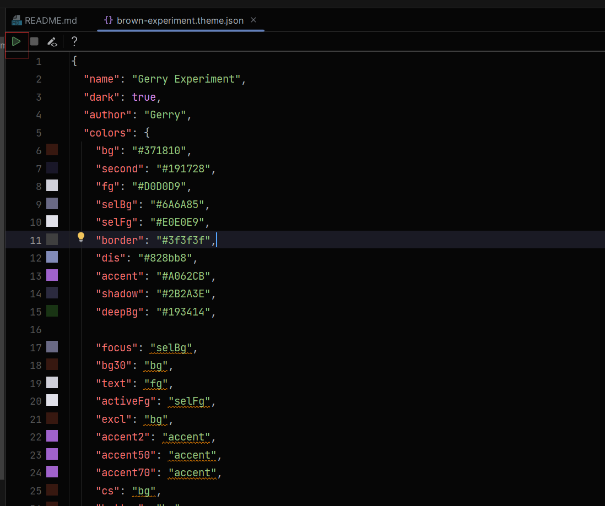

Gerry Themes is a refined themes collection designed for comfortable development experience. 

# How to run theme in IDE:
Pick one json file from themes folder, and you can run it in IntelliJ Idea to play themes.

# Special Thanks: 
*  Kings
*  Beansoft
*  Mallowigi

# Inspired By: 
*  Atom One Dark
*  Material Theme UI Lite for JetBrains